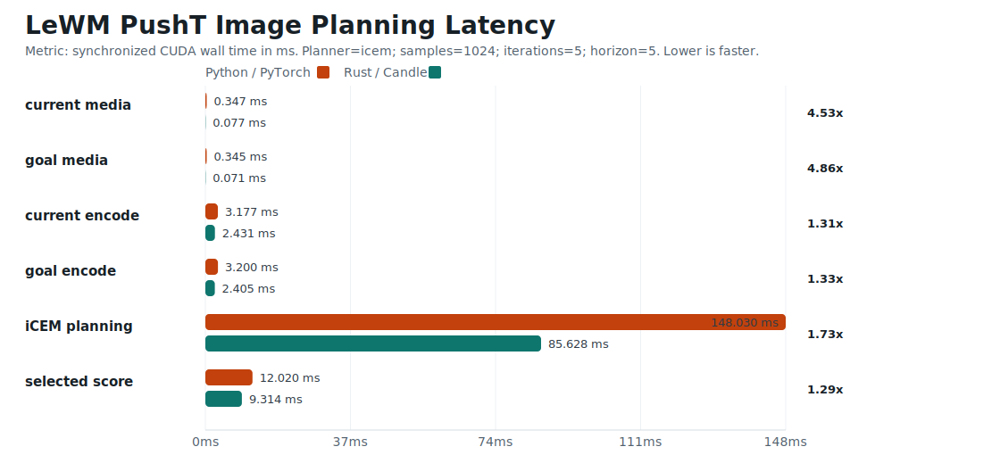
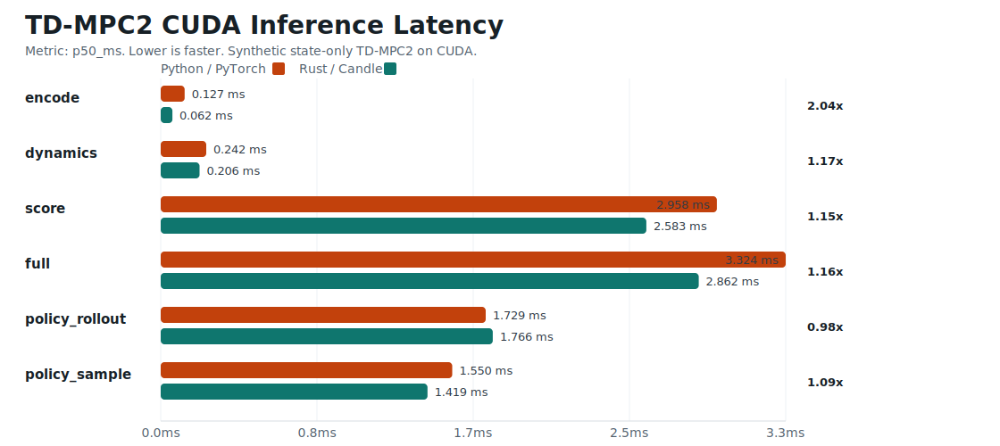

# stable-worldmodel-candle

CUDA-first Rust/Candle deployment runtime for `stable-worldmodel` checkpoints.


The goal is to keep the runtime control loop in one Rust/NVIDIA path:
load checkpoint, ingest media, preprocess on CUDA, encode observations, evaluate
world-model rollouts, score candidate actions, and return the selected action
through Rust or C ABI entrypoints.

## Runtime Mandate

This repo is not a portability layer. It is an NVIDIA deployment runtime, and
fast optimized inference is the primary outcome. CPU, macOS, Metal, and generic
host-first compatibility are intentionally out of scope.
Performance is not a preference here; it is the acceptance criterion. If a
runtime feature cannot stay on the NVIDIA/Candle CUDA path during inference, it
is incomplete.

Implementation choices should prefer the most direct NVIDIA path available:
CUDA kernels, cuDNN, nvJPEG, NPP, NVDEC/NVENC where they apply, and Candle CUDA
tensors as the shared runtime representation. Keep media buffers, preprocessed
observations, latent states, candidate action batches, rollout costs, and
selected actions device-resident through the hot path. Any avoidable Python
loop, host tensor copy, synchronization point, or generic image/video decoder in
the control loop should be treated as runtime debt.

When Candle does not expose the NVIDIA primitive we need, the expected direction
is to add a focused Candle CUDA op, bind the NVIDIA library directly, or use a
CUDA-compatible crate that preserves device residency. Broad-platform
compatibility is not a reason to keep slower runtime paths in this crate.

## Current Scope

- Linux/NVIDIA CUDA with cuDNN is the required runtime target. cuDNN is part of
  the default feature stack, and non-CUDA/non-cuDNN/non-Linux builds are
  rejected at compile time.
- LeWM runtime: ViT-Tiny image encoder, projection stack, action encoder,
  conditional predictor, latent rollout, goal embedding, goal cost, session
  caching, and Rust-native goal planning.
- TD-MPC2 runtime: state/vector, pixel, and mixed pixel+state observation
  encoders; latent dynamics; reward/Q heads; actor mean action; stochastic
  actor sampling; actor policy rollouts; candidate scoring; session caching;
  and Rust-native MPC planning.
- NVIDIA media path: nvJPEG decode into Candle CUDA tensors, packed
  RGB/BGR/RGBA/BGRA CUDA frame preprocessing, NV12 CUDA surface preprocessing,
  direct `libnvcuvid` NVDECODE capability probing and decoder lifecycle,
  fused resize/reorder/colorspace/normalization kernels, and history-slot
  writes for image/video control loops.
- Planning solvers: CEM, MPPI, and iCEM generate candidates, score world-model
  rollouts, select/update action sequences, and keep the hot planning path on
  Candle CUDA tensors.
- Deployment interfaces: Rust API, C ABI, explicit deployment artifact schema,
  `.safetensors` and PyTorch `.pt` state-dict loading, and optional Hugging Face
  Hub checkpoint download behind `--features hub`.
- Validation tooling: repo-local `uv` environment using the official
  `stable-worldmodel[train]` package, deterministic CUDA fixture exporters,
  LeWM and TD-MPC2 parity comparators, real LeWM fixture planning, cost argmin
  checks, and runtime benchmarks.
- Upstream support tracking: the audited `stable-worldmodel` commit is recorded
  in [docs/upstream-stable-worldmodel.md](docs/upstream-stable-worldmodel.md).
- CUDA smoke-test CLIs:

```bash
cargo run --bin lewm-inspect -- --action-dim 2
cargo run --bin tdmpc2-inspect -- --state-dim 12 --action-dim 4
```

With a checkpoint:

```bash
cargo run --release --bin lewm-inspect -- --weights /path/to/weights_epoch_100.pt --action-dim 2
cargo run --release --bin tdmpc2-inspect -- --weights /path/to/weights_epoch_250.pt --state-dim 12 --action-dim 4
```

## Checkpoints and Parity

The Python `stable_worldmodel.wm.utils.load_pretrained` path resolves model repos
from Hugging Face by downloading:

```text
config.json
weights.pt
```

Official LeWM mirrors currently use this layout, for example
`quentinll/lewm-pusht`, `quentinll/lewm-reacher`, and
`quentinll/lewm-tworooms`.

This repo includes `.python-version`, `pyproject.toml`, and `uv.lock` for parity
tooling. `.python-version` selects Python 3.12 for `uv`; `pyproject.toml`
declares the allowed Python range and dependencies. The Python environment
depends on the official `stable-worldmodel[train]` package and pins
`transformers<5` for the current public LeWM checkpoints, whose weights use the
Hugging Face ViT 4.x key layout (`encoder.encoder.layer.*`).

To export a deterministic Python fixture from the official implementation:

```bash
uv run --no-dev \
  python tools/export_lewm_fixture.py \
  --model quentinll/lewm-pusht \
  --device cuda \
  --output target/lewm-pusht-fixture-cuda.npz
```

For local upstream development, pass `--stable-worldmodel-root /path/to/source`
or set `STABLE_WORLDMODEL_ROOT=/path/to/source`.

Then compare Candle outputs against the Python fixture:

```bash
cargo run --bin lewm-compare-fixture -- \
  --device cuda:0 \
  --fixture target/lewm-pusht-fixture-cuda.npz \
  --weights ~/.stable_worldmodel/checkpoints/models--quentinll--lewm-pusht/weights.pt \
  --config ~/.stable_worldmodel/checkpoints/models--quentinll--lewm-pusht/config.json
```

Or let Rust download the same HF files through Candle-style hub support:

```bash
cargo run --features hub --bin lewm-compare-fixture -- \
  --device cuda:0 \
  --fixture target/lewm-pusht-fixture-cuda.npz \
  --hf-repo quentinll/lewm-pusht
```

The current verified PushT fixture covers pixel encoding, action embedding,
single-step prediction, latent rollout, and goal cost.

Real-checkpoint LeWM planning can be run against the same fixture and public
checkpoint:

```bash
uv run --locked --no-dev \
  python tools/export_lewm_fixture.py \
  --model quentinll/lewm-pusht \
  --device cuda \
  --output target/lewm-pusht-real-python-cuda.npz

cargo run --release --locked --features hub --bin lewm-compare-fixture -- \
  --device cuda \
  --fixture target/lewm-pusht-real-python-cuda.npz \
  --hf-repo quentinll/lewm-pusht

cargo run --release --locked --features hub --bin lewm-plan-fixture -- \
  --device cuda \
  --fixture target/lewm-pusht-real-python-cuda.npz \
  --hf-repo quentinll/lewm-pusht \
  --samples 128 \
  --iterations 3 \
  --seed 7 \
  --json > target/bench/lewm-pusht-real-plan-cuda.json
```

Latest real PushT checkpoint run, 2026-06-02 on an NVIDIA GeForce RTX 4090:

- Python fixture: official `stable_worldmodel`, PyTorch `2.12.0+cu130`, CUDA
  `13.0`, checkpoint `quentinll/lewm-pusht`.
- Candle CUDA parity against the fresh Python CUDA fixture:
  `emb=5.731881e-4`, `act_emb=4.768372e-7`, `pred=7.328391e-4`,
  `rollout=6.533712e-4`, `cost=5.619049e-3`; cost argmin was stable.
- Planner setup: horizon `5`, samples `128`, elites `32`, iterations `3`,
  action dim `10`, seed `7`, fixture candidate baseline best cost
  `14.485378`.
- Real Rust planner results against the PushT goal embedding:

| Planner | Best cost | Improvement vs fixture baseline | Elapsed |
| --- | ---: | ---: | ---: |
| CEM | `9.718345` | `4.767034` | `40.448 ms` |
| MPPI | `10.074890` | `4.410488` | `24.726 ms` |
| iCEM | `9.702090` | `4.783288` | `25.457 ms` |

Real PushT LeWM planning uses the actual `swm/PushT-v1` environment, the
public `quentinll/lewm-pusht` checkpoint, and real frames from
`~/.stable_worldmodel/pusht_expert_train.h5`. The H5 stores pixels with the
Blosc filter, so the Python tooling includes `hdf5plugin`.

```bash
uv run --locked --no-dev \
  python tools/run_pusht_lewm_rust_demo.py \
  --output-dir target/reports/pusht-real-demo \
  --hf-repo quentinll/lewm-pusht \
  --planner icem \
  --samples 1024 \
  --iterations 5 \
  --horizon 5 \
  --history-size 1 \
  --replans 2 \
  --seed 7 \
  --eval-seed 42 \
  --eval-index 0 \
  --open

cargo run --release --locked --features hub --bin lewm-plan-images -- \
  --hf-repo quentinll/lewm-pusht \
  --current target/reports/pusht-real-demo/input/dataset-current.jpg \
  --goal target/reports/pusht-real-demo/input/dataset-goal.jpg \
  --planner icem \
  --samples 1024 \
  --iterations 5 \
  --horizon 5 \
  --history-size 1 \
  --seed 7 \
  --output target/reports/pusht-real-demo/lewm-pusht-rust-plan-r00.html

uv run --locked --no-dev \
  python tools/benchmark_lewm_plan_images_python.py \
  --model quentinll/lewm-pusht \
  --current target/reports/pusht-real-demo/input/dataset-current.jpg \
  --goal target/reports/pusht-real-demo/input/dataset-goal.jpg \
  --planner icem \
  --samples 1024 \
  --iterations 5 \
  --horizon 5 \
  --history-size 1 \
  --seed 7 \
  --output target/reports/pusht-real-demo/lewm-pusht-python-plan-r00.json
```



Latest real PushT planning run, 2026-06-02 on an NVIDIA GeForce RTX 4090:

- Demo output: `target/reports/pusht-real-demo/pusht-demo.html`,
  `target/reports/pusht-real-demo/pusht-demo.json`, and
  `target/reports/pusht-real-demo/rollout/rollout.gif`.
- Rust planner outputs:
  `target/reports/pusht-real-demo/lewm-pusht-rust-plan-r00.json` and
  `target/reports/pusht-real-demo/lewm-pusht-rust-plan-r01.json`.
- Python comparison output:
  `target/reports/pusht-real-demo/lewm-pusht-python-plan-r00.json`.
- Checkpoint: `quentinll/lewm-pusht`, Hugging Face snapshot
  `22b330c28c27ead4bfd1888615af1340e3fe9052`.
- Dataset sample: row `209214`, episode `1694`, start step `63`, goal row
  `209239`, goal offset `25`.
- Setup: real PushT H5 current/goal images, history size `1`, checkpoint
  history size `3`, horizon `5`, action dim `10`, iCEM samples `1024`,
  elites `256`, iterations `5`, planner seed `7`.
- Rust env demo: two replans, `47` executed env actions, success `true`,
  final distance `28.178723`, planner costs `95.319412 -> 33.028206`,
  total planner time `513.175 ms`.
- Candidate RNG is backend-native: Rust uses cuRAND through Candle/cudarc,
  Python uses PyTorch CUDA RNG. Compare workload latency and cost distribution;
  identical first actions are not expected from this run.

| Stage | Rust CUDA | Python CUDA | Python/Rust |
| --- | ---: | ---: | ---: |
| Current JPEG decode + preprocess | `16.673 ms` | `20.175 ms` | `1.21x` |
| Goal JPEG decode + preprocess | `0.120 ms` | `0.824 ms` | `6.87x` |
| Current LeWM encode | `143.124 ms` | `137.283 ms` | `0.96x` |
| Goal LeWM encode | `2.798 ms` | `3.557 ms` | `1.27x` |
| iCEM planning | `261.153 ms` | `256.130 ms` | `0.98x` |
| Selected-score pass | `17.992 ms` | `19.714 ms` | `1.10x` |

| Metric | Rust CUDA | Python CUDA |
| --- | ---: | ---: |
| Selected cost | `95.319412` | `52.160725` |
| Final candidate best | `95.319305` | `52.160690` |
| Final candidate mean | `217.092865` | `222.353424` |
| Final candidate p50 | `207.558655` | `208.755234` |
| Final candidate p95 | `306.528168` | `320.742249` |

Regenerate the LeWM image-planning graph:

```bash
uv run --locked --no-dev \
  python tools/plot_lewm_image_plan_comparison.py \
  --python target/reports/pusht-real-demo/lewm-pusht-python-plan-r00.json \
  --rust target/reports/pusht-real-demo/lewm-pusht-rust-plan-r00.json \
  --output docs/lewm-image-plan-python-rust-benchmark.svg \
  --title "LeWM PushT Image Planning Latency"
```

TD-MPC2 state/vector fixture export uses a deterministic Python model and saves
both an `.npz` fixture and a `.pt` state dict:

```bash
uv run --no-dev \
  python tools/export_tdmpc2_fixture.py \
  --device cuda \
  --output target/tdmpc2-state-python-cuda.npz \
  --weights-output target/tdmpc2-state-weights.pt

cargo run --bin tdmpc2-compare-fixture -- \
  --device cuda:0 \
  --fixture target/tdmpc2-state-python-cuda.npz \
  --weights target/tdmpc2-state-weights.pt
```

The same exporter and comparator cover pixel-only and mixed pixel+state
fixtures:

```bash
uv run --no-dev \
  python tools/export_tdmpc2_fixture.py \
  --fixture-kind pixel \
  --device cuda \
  --output target/tdmpc2-pixel-python-cuda.npz \
  --weights-output target/tdmpc2-pixel-weights.pt

cargo run --bin tdmpc2-compare-fixture -- \
  --device cuda:0 \
  --fixture target/tdmpc2-pixel-python-cuda.npz \
  --weights target/tdmpc2-pixel-weights.pt \
  --fixture-kind pixel
```

Use `--fixture-kind both` on both commands to validate combined pixel+state
encoding.

Self-contained Python tooling validation, run on 2026-06-01:

- `uv lock --locked` passed with `stable-worldmodel[train]` from PyPI.
- `uv run --locked --no-dev python ...` imported
  `stable_worldmodel` from this repo's `.venv`.
- `tools/export_tdmpc2_fixture.py` generated a CUDA state fixture using only this
  repo's locked Python environment.
- `cargo run --locked --bin tdmpc2-compare-fixture -- --fixture
  target/tdmpc2-self-contained-python-cuda.npz --weights
  target/tdmpc2-self-contained-weights.pt --device cuda:0` passed with max abs diffs:
  `z=8.94e-8`, `next_z=1.49e-7`, `reward_logits=0`, `actor_mean=1.19e-7`,
  `cost=0`, and stable cost argmin.

## Deployment Artifacts

The preferred runtime package is a directory with explicit model, preprocessing,
and I/O schema metadata:

```text
config.json
model.safetensors
preprocess.json
schema.json
```

`weights.pt` is accepted for legacy artifacts when `model.safetensors` is not
present. `schema.json` describes observation names, observation kinds
(`state`, `image`, or `video`), observation shapes, and action dimensionality.
`preprocess.json` records runtime preprocessing metadata such as image size,
normalization, and action bounds.

Convert a raw PyTorch state dict to the preferred safetensors payload with:

```bash
uv run --no-dev \
  python tools/convert_state_dict_safetensors.py \
  --input /path/to/weights.pt \
  --output /path/to/artifact/model.safetensors
```

If the checkpoint keys are wrapped, pass `--strip-prefix model.` or another
exact prefix as needed. The converter accepts raw tensor-only state dicts and
checkpoints containing a tensor-only `state_dict`.

Latest local safetensors conversion validation, run on 2026-06-01:

- `tools/convert_state_dict_safetensors.py` converted the TD-MPC2 sampled actor
  fixture weights into `target/tdmpc2-state-sampled-model.safetensors`.
- `tdmpc2-compare-fixture` loaded the safetensors file on CUDA and matched the
  Python CUDA fixture, including sampled actor outputs and stable cost argmin.

Core preprocessing supports already-decoded RGB frame buffers and state/action
arrays. RGB frames can be resized, normalized, stacked as `[batch, time,
channels, height, width]`, converted to the latest `[batch, channels, height,
width]` frame for pixel models, and moved to the selected Candle device. State
vectors can be mean/std normalized, and actions can be clamped to configured
bounds. CUDA media ingestion adds the NVIDIA path for encoded image bytes and
CUDA-resident packed frame tensors.
TD-MPC2 pixel inputs use the upstream CNN layout (`cnn.0`, `cnn.2`, `cnn.4`,
`cnn.6`, then `pixel_encoder`) and accept either NCHW or NHWC tensors before
SimNorm.

## NVIDIA Media Runtime

Required CUDA/cuDNN builds expose `media` for NVIDIA media ingestion. JPEG bytes
are decoded by NVIDIA nvJPEG directly into a Candle CUDA `U8` tensor on Candle's
CUDA stream, then the fused CUDA preprocessor produces model-ready tensors:

```text
encoded JPEG bytes
  -> nvJPEG decode
  -> U8 RGB interleaved Candle CUDA tensor [1, height, width, 3]
  -> fused CUDA resize/reorder/normalize
  -> F32 NCHW Candle CUDA tensor
```

The lower-level packed-frame path accepts existing CUDA tensors and owns a
reusable model-ready output tensor:

```text
packed U8 RGB/BGR/RGBA/BGRA CUDA tensor
  -> bilinear resize
  -> channel reorder to RGB
  -> /255
  -> mean/std normalization
  -> F32 NCHW Candle CUDA tensor
```

The C ABI exposes opaque `SwmCudaImage` and `SwmCudaNv12` handles for callers
that need Rust-owned, Candle-compatible CUDA buffers. Callers allocate a buffer,
query its device pointer and pitch, write with CUDA/NVIDIA APIs, then reset the
runtime directly from that buffer:

```text
SwmCudaImage / SwmCudaNv12
  -> device pointer query
  -> caller writes with CUDA, nvJPEG, NPP, or NVDEC/NVDECODE
  -> caller completes the write on its CUDA stream
  -> swm_*_reset_cuda_image / swm_*_reset_cuda_nv12
  -> fused CUDA preprocess
  -> session reset on model-ready Candle CUDA tensor
```

TD-MPC2 and LeWM CUDA media reset entrypoints cache their packed-image and NV12
preprocessor outputs inside the runtime handle. Repeated calls with the same
shape, normalization config, and NV12 color space reuse the same Candle CUDA
output tensor; incompatible media settings rebuild the cached preprocessor.

NVDECODE capability probing is linked directly against `libnvcuvid`.
`media::nvdec::query_caps_420` and `swm_nvdec_query_420` bind the same Candle
CUDA context used by model inference, then query codec support for 4:2:0 video
at the requested bit depth. Use `bit_depth_minus_8 = 0` for 8-bit H.264/HEVC/AV1
streams and `2` for 10-bit surfaces. `NvDecDecoder::new_nv12` and
`swm_nvdec_decoder_create_420` create an 8-bit 4:2:0 CUVID decoder with NV12
output on that same context.
`NvDecSession::new_nv12` and `swm_nvdec_session_create_420` add parser
callbacks for Annex B packet ingestion. `decode_annexb_to_nv12` and
`swm_nvdec_session_decode_annexb_to_nv12` call `cuvidParseVideoData`, decode
pictures, map display frames, and launch a CUDA copy from the mapped NV12
surface into a Rust-owned `SwmCudaNv12` buffer.

For video-surface ingestion, `Nv12Preprocessor` accepts CUDA-resident NV12
planes as `Y [batch, height, width]` and `UV [batch, height / 2, width / 2, 2]`.
It fuses BT.601/BT.709 YUV-to-RGB conversion, full/video range handling,
bilinear resize, `/255`, mean/std normalization, and NCHW or history-slot
writes in one CUDA kernel.

`NvJpegDecoder::decode_rgb_interleaved_into` writes into caller-owned CUDA
RGB buffers for reuse. `decode_preprocessed_nchw_into` decodes and preprocesses
into a persistent `ImagePreprocessor` output. `ImageHistoryPreprocessor`
and `Nv12HistoryPreprocessor` write decoded frame formats into selected
`[batch, time, 3, height, width]` slots for LeWM image-history and video
pipelines.

Build and validate the NVIDIA media path:

```bash
cargo test --locked media::nvdec -- --nocapture
cargo test --locked ffi_nvdec -- --nocapture
cargo test media -- --nocapture
cargo check --all-targets
cargo test media -- --nocapture
```

For a real H.264 Annex B parser/map/copy smoke, generate a one-frame stream
with GStreamer and point the opt-in test at it:

```bash
mkdir -p target/nvdec-smoke
gst-launch-1.0 -q videotestsrc num-buffers=1 pattern=black \
  ! 'video/x-raw,width=64,height=64,framerate=1/1' \
  ! x264enc tune=zerolatency speed-preset=ultrafast byte-stream=true key-int-max=1 \
  ! filesink location=target/nvdec-smoke/black64.h264

SWM_NVDEC_TEST_PACKET=target/nvdec-smoke/black64.h264 \
  cargo test --locked decodes_annexb_packet_from_env_to_nv12_on_cuda -- --nocapture
```

Set `CUDA_HOME` or `CUDA_PATH` when CUDA is installed outside the standard
`/usr/local/cuda*` locations so Cargo can find the NVIDIA libraries. Set
`NVIDIA_VIDEO_CODEC_SDK_PATH` when `libnvcuvid.so` is installed outside the
standard linker paths.

Latest local NVDECODE capability validation, run on 2026-06-01:

- `cargo test --locked media::nvdec -- --nocapture` passed.
- `cargo test --locked ffi_nvdec -- --nocapture` passed.
- `SWM_NVDEC_TEST_PACKET=target/nvdec-smoke/black64.h264 cargo test --locked decodes_annexb_packet_from_env_to_nv12_on_cuda -- --nocapture` passed after generating the packet with the GStreamer command above.
- H.264 8-bit 4:2:0 caps on `cuda:0`: supported, 1 NVDEC, NV12 output,
  min `48x16`, max `4096x4096`, histogram support enabled with 256 bins.
- H.264 64x64 NV12 decoder create/destroy and parser-session create/destroy
  passed through Rust and C ABI tests.

For backend parity, generate a Python CUDA fixture, then compare Candle CUDA
against it:

```bash
uv run --no-dev \
  python tools/export_lewm_fixture.py \
  --model quentinll/lewm-pusht \
  --device cuda \
  --output target/lewm-pusht-python-cuda.npz

cargo run --release --features hub --bin lewm-compare-fixture -- \
  --device cuda:0 \
  --fixture target/lewm-pusht-python-cuda.npz \
  --hf-repo quentinll/lewm-pusht
```

The fixture exporter disables TF32 matmul/cuDNN paths, disables cuDNN
benchmarking, runs with gradients off, and exports model outputs after
`model.eval()`.

## NVIDIA Build

Linux with NVIDIA CUDA and cuDNN is required. The crate rejects non-Linux
targets and builds without the CUDA/cuDNN feature stack at compile time.
Install the NVIDIA libraries needed by the runtime path you are validating:
CUDA Toolkit, cuDNN, `libnvcuvid`, and for encoded image ingestion, nvJPEG.
NPP is expected for additional YUV/video conversion surfaces as those paths
are implemented.

CUDA/cuDNN is the default runtime:

```bash
cargo check --all-targets
```

Run a CUDA smoke:

```bash
cargo run --release --bin lewm-inspect -- \
  --device cuda \
  --weights /path/to/weights_epoch_100.pt \
  --action-dim 2
```

Full LeWM CUDA parity matrix:

```bash
tools/cuda_parity.sh
```

The matrix runs environment sanity checks, Rust CUDA/cuDNN build/tests, Python
CUDA fixture export, and Candle CUDA vs Python CUDA. Set `MODEL`,
`CUDA_FIXTURE` or `CARGO_LOCKED=0` to override defaults. Set
`STABLE_WORLDMODEL_ROOT` only when testing a local Python source tree instead of
the locked package.

Default parity tolerances are per-output: `act_emb=1e-5`, `emb=1e-3`,
`pred=1e-3`, `rollout=2e-3`, and `cost=1e-2`. The Python and Rust comparators
also reject NaNs/Infs and require cost argmin/top-candidate stability.

Latest local CUDA parity result, run on 2026-05-29:

- Host: NVIDIA GeForce RTX 4090, driver `580.159.03`, `nvidia-smi` CUDA
  `13.0`, `nvcc 13.0.88`.
- Python fixture env: PyTorch `2.10.0+cu128`, `torch.cuda.is_available() ==
  True`, `torch.version.cuda == 12.8`.
- Rust CUDA/cuDNN build and test checks passed.

| Comparison | `emb` max abs | `act_emb` max abs | `pred` max abs | `rollout` max abs | `cost` max abs | Cost argmin |
| --- | ---: | ---: | ---: | ---: | ---: | --- |
| Candle CUDA vs Python CUDA | `2.174266e-04` | `4.768372e-07` | `4.823357e-04` | `6.892309e-04` | `4.647255e-03` | stable |

Latest local TD-MPC2 pixel parity result, run on 2026-05-29:

- Candle CUDA vs Python CUDA pixel fixture: `z=2.235174e-08`,
  `next_z=1.490116e-07`, `actor_mean=2.682209e-07`, `cost=0`, cost argmin
  stable.
- Candle CUDA vs Python CUDA mixed pixel+state fixture:
  `z=1.788139e-07`, `next_z=1.788139e-07`, `actor_mean=1.024455e-07`,
  `cost=0`, cost argmin stable.

Latest local TD-MPC2 sampled actor parity result, run on 2026-06-01:

- `tools/export_tdmpc2_fixture.py` exported a CUDA state fixture with
  `--actor-trajs 4`.
- Candle CUDA vs Python CUDA:
  `actor_log_std=9.536743e-07`, `actor_sample=1.341105e-07`,
  `actor_sample_rollout=1.937151e-07`, cost argmin stable.

## Runtime Benchmarks

Synthetic latency baselines are available through `runtime-bench`:

```bash
cargo run --release --bin runtime-bench -- \
  --model td-mpc2 \
  --device cuda:0 \
  --samples 64 \
  --horizon 5 \
  --planner-iterations 2 \
  --json
```

The benchmark synchronizes the selected Candle device around timed sections, so
CUDA timings include queued device work rather than just launch overhead.
Current sections cover synthetic encode, dynamics where applicable,
rollout or scoring, packed U8 and NV12 CUDA media preprocessing, TD-MPC2
actor-mean and sampled policy rollouts, an end-to-end synthetic path, C ABI
call rows, and planner latency for CEM, MPPI, and iCEM. Planner sections reuse
reset sessions, so they measure the hot MPC loop after observation encoding has
been cached. LeWM media rows preprocess `batch * history` 224x224 frames;
TD-MPC2 media rows preprocess 64x64 batch frames.

Latest local runtime validation after adding CUDA media preprocessing benchmark
rows, run on 2026-06-01:

- `cargo check --locked --bin runtime-bench` passed.
- `cargo test --locked -- --nocapture` passed.
- `cargo check --locked --all-targets` passed.
- CUDA smoke completed with
  `cargo run --locked --bin runtime-bench -- --model td-mpc2 --device cuda --warmup 0 --iters 1 --samples 4 --horizon 2 --planner-iterations 1`.
  This debug smoke emitted `media_packed`, `media_nv12`, `policy_rollout`,
  `policy_sample_fixed`, `policy_sample_generated`, `ffi_actor_mean`,
  `ffi_policy_roll`, `ffi_policy_samp`, `plan_cem`, `ffi_plan_cem`,
  `ffi_plan_mppi`, `ffi_plan_icem`, `plan_mppi`, and `plan_icem` sections; use
  the release benchmark commands above for latency baselines.
- LeWM CUDA smoke completed with
  `cargo run --locked --bin runtime-bench -- --model le-wm --device cuda --warmup 0 --iters 1 --samples 2 --horizon 3 --planner-iterations 1 --action-dim 2`.
  This debug smoke emitted `media_packed`, `media_nv12`, `ffi_plan_cem`,
  `ffi_plan_mppi`, and `ffi_plan_icem` sections.

## Python Vs Rust Benchmark

The LeWM real-image planning benchmark compares the complete checkpoint path
for current/goal JPEGs: image decode/preprocess, current and goal encoding,
Rust/Python planner loop, and selected-sequence scoring.


The direct Python-vs-Rust timing comparison tracks TD-MPC2 CUDA runtime work
that both stacks can execute. The first row is encoded image ingestion:
Python decodes JPEG bytes with Pillow, converts RGB HWC data into a CUDA F32
NCHW tensor, and normalizes by 255. Rust decodes the same JPEG bytes through
nvJPEG into a Candle CUDA U8 RGB tensor, then runs the fused CUDA preprocessing
kernel into the model tensor. The remaining rows compare official
Python/PyTorch TD-MPC2 model sections against Rust/Candle: encode, dynamics,
candidate scoring, full encode+dynamics+score, actor mean rollout, and sampled
actor rollout. Actor mean rollout compares raw reward logits on both sides.
Sampled actor rollout is split into fixed-noise parity and generated-noise
deployment rows.

Rust-only media rows are still reported by `runtime-bench`: `media_packed`
measures CUDA-resident packed RGB preprocessing, and `media_nv12` measures
CUDA-resident NV12 colorspace/resize/normalization preprocessing for video
surfaces. Rust-native planners are reported by `runtime-bench` as separate
deployment rows because Python planner comparison is a separate benchmark
surface.



Latest local comparison, run on 2026-06-02 on an NVIDIA GeForce RTX 4090:

- Shape: 64x64 JPEG image, batch `1`, state dim `12`, action dim `10`,
  samples `64`, horizon `5`.
- Python: PyTorch `2.12.0+cu130`, CUDA `13.0`, official
  `stable_worldmodel.wm.tdmpc2.TDMPC2`, Pillow JPEG decode.
- Rust: `runtime-bench --model td-mpc2`, nvJPEG decode, and Candle CUDA
  preprocessing.
- Metric in the graph: p50 latency over 50 timed iterations after 10 warmup
  iterations. Lower is faster; the right-side multiplier is Python p50 divided
  by Rust p50.
- Encoded JPEG ingestion p50: Python `0.145 ms`, Rust `0.031 ms`, `4.61x`.
- Actor rollout p50 after matching work: `policy_rollout` `1.10x`,
  `policy_sample_fixed` `1.04x`, `policy_sample_generated` `1.05x`.
- Rust-only hot media rows from the same release run: `media_packed`
  `0.007 ms`, `media_nv12` `0.007 ms`.

Reproduce and regenerate the graph:

```bash
mkdir -p target/bench

uv run --locked --no-dev \
  python tools/make_benchmark_media.py \
  --jpeg-output target/bench/media64.jpg \
  --image-size 64

uv run --locked --no-dev \
  python tools/benchmark_tdmpc2_python.py \
  --warmup 10 \
  --iters 50 \
  --batch-size 1 \
  --samples 64 \
  --horizon 5 \
  --action-dim 10 \
  --jpeg-input target/bench/media64.jpg \
  --json-output target/bench/tdmpc2-python-cuda.json

cargo run --release --locked --bin runtime-bench -- \
  --model td-mpc2 \
  --device cuda \
  --warmup 10 \
  --iters 50 \
  --samples 64 \
  --horizon 5 \
  --planner-iterations 2 \
  --action-dim 10 \
  --jpeg-input target/bench/media64.jpg \
  --json > target/bench/tdmpc2-rust-cuda.json

uv run --locked --no-dev \
  python tools/plot_benchmark_comparison.py \
  --python target/bench/tdmpc2-python-cuda.json \
  --rust target/bench/tdmpc2-rust-cuda.json \
  --output docs/tdmpc2-python-rust-benchmark.svg
```

## Runtime Sessions

The library exposes initial family-specific session wrappers for repeated
control-loop use. `LeWmSession` caches encoded image history after
`reset_pixels`, and `TdMpc2Session` caches state and latent tensors after
`reset_state`, `reset_pixels`, or `reset_observations`. Both sessions keep
device and dtype selection explicit and expose candidate scoring methods that
reuse the cached current context.

## Planning Solvers

`planner::CemPlanner`, `planner::MppiPlanner`, and `planner::IcemPlanner`
provide the first Rust-native MPC solver surfaces. They generate action
candidates shaped
`[batch, samples, horizon, action_dim]`, score them through a `CandidateScorer`,
and return the first action plus the planned sequence:

```rust
use stable_worldmodel_candle::planner::{
    CemConfig, CemPlanner, IcemConfig, IcemPlanner, MppiConfig, MppiPlanner,
};

let cem = CemPlanner::new(CemConfig::new(5, 512, 64, action_dim));
let cem_action = cem.plan(&tdmpc2_session)?.first_action;

let mppi = MppiPlanner::new(MppiConfig::new(5, 512, action_dim));
let mppi_action = mppi.plan(&tdmpc2_session)?.first_action;

let mut icem = IcemPlanner::new(IcemConfig::new(5, 512, 64, action_dim));
let icem_action = icem.plan(&tdmpc2_session)?.first_action;
```

`TdMpc2Session` implements `CandidateScorer` directly. For LeWM, wrap a reset
session and goal embedding with `planner::LeWmGoalScorer`.

These planners keep candidate tensors, model rollout, and scoring on the
selected Candle device. CEM and iCEM use Candle sort/gather ops for elite
selection instead of host-side ranking, and MPPI computes its softmax-weighted
control update on the selected Candle device. Each planner also keeps a small
workspace cache for action-bound tensors and initial mean/std tensors, so those
fixed hot-path tensors are not rebuilt on every control step. iCEM carries
elites between iterations and keeps a shifted warm-start sequence between
`plan` calls. If a deadline expires before any iteration completes, CEM/MPPI
can return a configured action and iCEM first tries its previous warm-start
sequence.
`PlanResult` records whether the selected action came from normal planning,
warm-start, or configured-action deadline handling. Planner configs also accept
a `seed`; when set, the planner owns a cuRAND generator on the Candle CUDA
stream and reserves a non-overlapping offset range for each `plan` call. Fresh
planners replay exactly from the same seed, persistent planners advance across
control steps, and `reset_rng_sequence()` returns the planner to offset zero.
Leave `seed` unset for continuous device RNG sampling in deployment.

Latest local planner deadline and seeded-sampling validation, run on
2026-06-01:

- `cargo test --locked` passed.
- `cargo check --locked --all-targets` passed.
- Deadline tests cover CEM/MPPI configured actions and iCEM warm-start behavior
  without requiring the scorer/session to be reset; seeded CEM/MPPI/iCEM tests
  verify deterministic replay of candidate sampling, and cuRAND offset tests
  verify persistent planners advance then replay after `reset_rng_sequence()`.

## C ABI

The crate also builds a `cdylib` for C callers:

```bash
cargo build --release
```

The initial ABI matches the parity-covered TD-MPC2 runtime paths for state,
pixel, and mixed state+pixel artifacts with CEM, MPPI, or iCEM planning. It also
exposes LeWM image-history goal planning through the same planner configs. C
callers load a deployment artifact, reset the current observation batch, and
request an action:

```c
#include "stable_worldmodel_candle.h"

SwmTdMpc2 *rt = NULL;
SwmStatus status = swm_tdmpc2_load("/path/to/artifact", "cuda:0", "f32", &rt);
/* Use the reset call that matches the artifact's observation schema. */
status = swm_tdmpc2_reset_state(rt, state_f32, batch, state_dim);
status = swm_tdmpc2_reset_pixels(
    rt, pixels_f32, batch, image_size, image_size, SWM_PIXEL_LAYOUT_NCHW);
SwmCudaImage *image = NULL;
status = swm_cuda_image_alloc(
    "cuda:0", batch, src_height, src_width, SWM_PACKED_IMAGE_FORMAT_RGB, &image);
void *image_ptr = NULL;
size_t image_pitch = 0;
status = swm_cuda_image_ptr(image, &image_ptr, &image_pitch);
/* Fill image_ptr from CUDA/NVIDIA code, then submit it. */
status = swm_tdmpc2_reset_cuda_image(rt, image);
SwmNvDecCaps nvdec_caps = {0};
status = swm_nvdec_query_420("cuda:0", SWM_NVDEC_CODEC_H264, 0, &nvdec_caps);
SwmCudaNv12 *nv12 = NULL;
status = swm_cuda_nv12_alloc("cuda:0", 1, 64, 64, &nv12);
SwmNvDecSession *nvdec_session = NULL;
status = swm_nvdec_session_create_420(
    "cuda:0", SWM_NVDEC_CODEC_H264, 64, 64, 20, 2, &nvdec_session);
size_t decoded_frames = 0;
status = swm_nvdec_session_decode_annexb_to_nv12(
    nvdec_session, h264_annexb_bytes, h264_annexb_len, nv12, &decoded_frames);
status = swm_tdmpc2_reset_cuda_nv12(rt, nv12, SWM_NV12_COLOR_SPACE_BT709_VIDEO);
status = swm_tdmpc2_reset_state_pixels(
    rt, state_f32, pixels_f32, batch, state_dim, image_size, image_size,
    SWM_PIXEL_LAYOUT_NCHW);
status = swm_tdmpc2_actor_mean_action(rt, action_out);
status = swm_tdmpc2_rollout_actor_mean(rt, horizon, sequence_out, reward_out);
status = swm_tdmpc2_rollout_actor_sample(rt, horizon, num_trajs, sequence_out);
status = swm_tdmpc2_plan_cem(rt, cem_cfg, action_out, sequence_out, best_cost_out);
status = swm_tdmpc2_plan_icem(rt, icem_cfg, action_out, sequence_out, best_cost_out);
swm_nvdec_session_free(nvdec_session);
swm_cuda_nv12_free(nv12);
swm_tdmpc2_free(rt);

SwmLeWm *lewm = NULL;
status = swm_lewm_load("/path/to/lewm-artifact", "cuda:0", "f32", &lewm);
status = swm_lewm_reset_pixels(
    lewm, current_pixels_f32, batch, history_size, image_size, image_size);
status = swm_lewm_reset_cuda_image_history(lewm, image, batch, history_size);
status = swm_lewm_set_goal_pixels(
    lewm, goal_pixels_f32, batch, goal_frames, image_size, image_size);
status = swm_lewm_plan_cem(lewm, cem_cfg, action_out, sequence_out, best_cost_out);
swm_cuda_image_free(image);
swm_lewm_free(lewm);
```

`swm_last_error_message()` returns a thread-local error string after non-OK
statuses. The matching declarations live in
`include/stable_worldmodel_candle.h`. `swm_tdmpc2_reset_pixels` expects f32
tensors already resized and normalized for the model, with explicit NCHW or
NHWC layout. `swm_tdmpc2_reset_cuda_image` and `swm_tdmpc2_reset_cuda_nv12`
preprocess Rust-owned CUDA buffers using artifact preprocessing metadata before
resetting the session. Those CUDA media reset paths reuse their internal
preprocessor output tensors across matching calls. `swm_tdmpc2_plan_icem` keeps
its shifted warm-start sequence inside the runtime handle; call
`swm_tdmpc2_clear_icem_warm_start` when resetting an episode.
`swm_lewm_reset_pixels` expects `[batch, time, 3, image_size, image_size]` f32
history tensors; `swm_lewm_reset_cuda_image_history` and
`swm_lewm_reset_cuda_nv12_history` take packed CUDA media batches shaped as
`batch * time` frames and preprocess them into the same history tensor. Set a
goal with `swm_lewm_set_goal_pixels` or a CUDA media goal-history entrypoint
before calling a LeWM planner entrypoint.

Latest local C ABI validation after adding CUDA media handle preprocessor
caches, public NVDEC parser-session declarations, NVDECODE capability, decoder
and parser lifecycle, and TD-MPC2 actor policy entrypoints including sampled
actor rollout, run on 2026-06-01:

- `cargo check --locked --all-targets` passed.
- `cargo test --locked ffi::tests::tdmpc2_cuda_media_preprocessors_reuse_outputs -- --nocapture` passed.
- `cargo test --locked ffi::tests::tdmpc2_actor_policy_c_abi_writes_outputs -- --nocapture` passed.
- `cargo test --locked ffi_actor -- --nocapture` passed.
- `cargo test --locked ffi_rollout_actor -- --nocapture` passed.
- `cargo test --locked ffi_rollout_actor_sample -- --nocapture` passed.
- `cargo test --locked --test ffi -- --nocapture` passed.
- `cargo test --locked ffi_nvdec -- --nocapture` passed.
- `cargo build --locked --release --lib` produced the release library.

## Source Layout

```text
src/
├── checkpoint.rs        # weight-loading helpers
├── config.rs            # top-level model selection config
├── models/
│   ├── mod.rs
│   └── lewm/            # LeWM backend
│   └── tdmpc2/          # state/vector TD-MPC2 backend
├── media/               # NVIDIA media decode/preprocess path
├── ffi.rs               # C ABI entrypoints
├── planner.rs           # Rust planning solvers
└── bin/
    └── lewm-inspect.rs  # LeWM smoke-test CLI
    └── tdmpc2-inspect.rs
```

Future stable-worldmodel backends can be added as sibling modules, for example
`models::pldm` or `models::prejepa`. Crate-root APIs should stay focused on
shared loading and configuration utilities.

## Alignment Notes

The Python repo state-dict path saves checkpoints as:

```text
config.json
weights_epoch_N.pt
```

The Rust model intentionally uses the same module names where possible:

- `encoder.embeddings.*`
- `encoder.encoder.layer.*`
- `encoder.layernorm.*`
- `projector.net.*`
- `action_encoder.patch_embed.*`
- `predictor.transformer.layers.*`
- `pred_proj.net.*`

That means raw LeWM `model.state_dict()` checkpoints should be loadable without renaming, assuming the same LeWM config and action dimension.

TD-MPC2 object checkpoints (`*_object.ckpt`) are serialized Python objects and
are not directly Candle-loadable. For Candle, export a state dict or safetensors
checkpoint plus config.

## Remaining Work

- Add compact fixture integration tests once small public test weights are available.
- Extend planner buffer reuse to larger candidate, score, latent, and rollout tensors where it lowers steady-state latency.
- Add additional sibling model backends starting from the simplest production inference path for each model.
