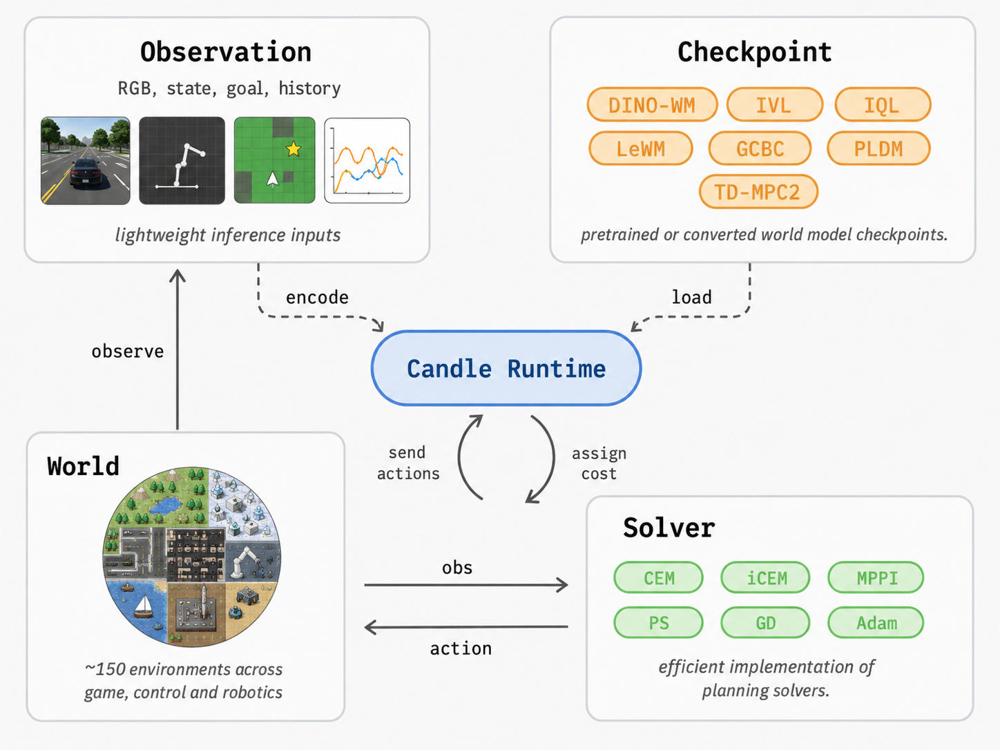

# stable-worldmodel-candle

Rust/Candle inference runtime for `stable-worldmodel` checkpoints.



Model implementations live under `src/models/`. Shared checkpoint and config
helpers live at the crate root, and CLIs select a backend explicitly.

## Current Scope

- Top-level modules: `checkpoint`, `config`, and `models`.
- `models::lewm`: ViT-Tiny encoder, projector, action encoder, conditional predictor, latent rollout, and goal MSE cost.
- `models::tdmpc2`: state/vector and pixel observation encoders, latent dynamics, reward/Q heads, actor mean action, and candidate cost scoring.
- Loading from PyTorch `.pt` state dicts via `VarBuilder::from_pth`, or from `.safetensors`.
- Optional Hugging Face Hub checkpoint download support behind `--features hub`.
- Rust 2024 edition with published Candle crates.
- Backend-specific shape smoke-test CLIs:

```bash
cargo run --bin lewm-inspect -- --action-dim 2
cargo run --bin tdmpc2-inspect -- --state-dim 12 --action-dim 4
```

With a checkpoint:

```bash
cargo run --release --bin lewm-inspect -- --weights /path/to/weights_epoch_100.pt --action-dim 2
cargo run --release --bin tdmpc2-inspect -- --weights /path/to/weights_epoch_250.pt --state-dim 12 --action-dim 4
```

## Checkpoints and Parity

The Python `stable_worldmodel.wm.utils.load_pretrained` path resolves model repos
from Hugging Face by downloading:

```text
config.json
weights.pt
```

Official LeWM mirrors currently use this layout, for example
`quentinll/lewm-pusht`, `quentinll/lewm-reacher`, and
`quentinll/lewm-tworooms`.

To export a deterministic Python fixture from the original implementation:

```bash
# From a checkout where stable-worldmodel and stable-worldmodel-candle are siblings.
cd stable-worldmodel
uv run --python 3.12 --no-dev --extra train \
  --with imageio --with 'transformers<5' \
  python ../stable-worldmodel-candle/tools/export_lewm_fixture.py \
  --stable-worldmodel-root . \
  --model quentinll/lewm-pusht \
  --device cpu \
  --output ../stable-worldmodel-candle/target/lewm-pusht-fixture.npz
```

The `transformers<5` pin matters for the current public LeWM checkpoints: the
weights use the Hugging Face ViT 4.x key layout (`encoder.encoder.layer.*`).

Then compare Candle outputs against the Python fixture:

```bash
cd ../stable-worldmodel-candle
cargo run --bin lewm-compare-fixture -- \
  --fixture target/lewm-pusht-fixture.npz \
  --weights ~/.stable_worldmodel/checkpoints/models--quentinll--lewm-pusht/weights.pt \
  --config ~/.stable_worldmodel/checkpoints/models--quentinll--lewm-pusht/config.json
```

Or let Rust download the same HF files through Candle-style hub support:

```bash
cargo run --features hub --bin lewm-compare-fixture -- \
  --fixture target/lewm-pusht-fixture.npz \
  --hf-repo quentinll/lewm-pusht
```

The current verified PushT fixture covers pixel encoding, action embedding,
single-step prediction, latent rollout, and goal cost.

TD-MPC2 state/vector fixture export uses a deterministic Python model and saves
both an `.npz` fixture and a `.pt` state dict:

```bash
cd stable-worldmodel
uv run --python 3.12 --no-dev \
  --with imageio \
  python ../stable-worldmodel-candle/tools/export_tdmpc2_fixture.py \
  --stable-worldmodel-root . \
  --device cpu \
  --output ../stable-worldmodel-candle/target/tdmpc2-state-python-cpu.npz \
  --weights-output ../stable-worldmodel-candle/target/tdmpc2-state-weights.pt

cd ../stable-worldmodel-candle
cargo run --bin tdmpc2-compare-fixture -- \
  --fixture target/tdmpc2-state-python-cpu.npz \
  --weights target/tdmpc2-state-weights.pt
```

The same exporter and comparator cover pixel-only and mixed pixel+state
fixtures:

```bash
cd stable-worldmodel
uv run --python 3.12 --no-dev \
  --with imageio \
  python ../stable-worldmodel-candle/tools/export_tdmpc2_fixture.py \
  --stable-worldmodel-root . \
  --fixture-kind pixel \
  --device cpu \
  --output ../stable-worldmodel-candle/target/tdmpc2-pixel-python-cpu.npz \
  --weights-output ../stable-worldmodel-candle/target/tdmpc2-pixel-weights.pt

cd ../stable-worldmodel-candle
cargo run --bin tdmpc2-compare-fixture -- \
  --fixture target/tdmpc2-pixel-python-cpu.npz \
  --weights target/tdmpc2-pixel-weights.pt \
  --fixture-kind pixel
```

Use `--fixture-kind both` on both commands to validate combined pixel+state
encoding.

## Deployment Artifacts

The preferred runtime package is a directory with explicit model, preprocessing,
and I/O schema metadata:

```text
config.json
model.safetensors
preprocess.json
schema.json
```

`weights.pt` is accepted as a compatibility fallback when `model.safetensors` is
not present. `schema.json` describes observation names, observation kinds
(`state`, `image`, or `video`), observation shapes, and action dimensionality.
`preprocess.json` records runtime preprocessing metadata such as image size,
normalization, and action bounds.

Core preprocessing currently supports already-decoded RGB frame buffers and
state/action arrays without adding image or video decoding dependencies. RGB
frames can be resized, normalized, stacked as `[batch, time, channels, height,
width]`, converted to the latest `[batch, channels, height, width]` frame for
pixel models, and moved to the selected Candle device. State vectors can be
optionally mean/std normalized, and actions can be clamped to configured
bounds. Optional file/video decoding can be layered on top of this later
without changing the core tensor path.
TD-MPC2 pixel inputs use the upstream CNN layout (`cnn.0`, `cnn.2`, `cnn.4`,
`cnn.6`, then `pixel_encoder`) and accept either NCHW or NHWC tensors before
SimNorm.

## NVIDIA Media Runtime

CUDA builds expose `cuda_media` for NVIDIA-first image ingestion. The current
path owns a reusable model-ready Candle CUDA tensor and launches a fused CUDA
kernel on Candle's CUDA stream:

```text
packed U8 RGB/BGR/RGBA/BGRA CUDA tensor
  -> bilinear resize
  -> channel reorder to RGB
  -> /255
  -> mean/std normalization
  -> F32 NCHW Candle CUDA tensor
```

`CudaImagePreprocessor` is the first device-resident bridge for nvJPEG,
nvImageCodec, NPP, and NVDEC work. It writes into a persistent output tensor
that can be passed directly to LeWM or TD-MPC2 pixel paths without host
readback.
`CudaImageHistoryPreprocessor` writes the same decoded frame format into a
selected `[batch, time, 3, height, width]` slot for LeWM image-history and video
pipelines.

For backend parity, generate CPU and CUDA Python fixtures from identical CPU
input tensors, then compare them before comparing Candle:

```bash
cd stable-worldmodel
uv run --python 3.12 --no-dev --extra train \
  --with imageio --with 'transformers<5' \
  python ../stable-worldmodel-candle/tools/export_lewm_fixture.py \
  --stable-worldmodel-root . \
  --model quentinll/lewm-pusht \
  --device cpu \
  --output ../stable-worldmodel-candle/target/lewm-pusht-python-cpu.npz

uv run --python 3.12 --no-dev --extra train \
  --with imageio --with 'transformers<5' \
  python ../stable-worldmodel-candle/tools/export_lewm_fixture.py \
  --stable-worldmodel-root . \
  --model quentinll/lewm-pusht \
  --device cuda \
  --output ../stable-worldmodel-candle/target/lewm-pusht-python-cuda.npz

uv run --python 3.12 --no-dev --extra train \
  python ../stable-worldmodel-candle/tools/compare_npz.py \
  ../stable-worldmodel-candle/target/lewm-pusht-python-cpu.npz \
  ../stable-worldmodel-candle/target/lewm-pusht-python-cuda.npz \
  --left-label python-cpu \
  --right-label python-cuda
```

The fixture exporter disables TF32 matmul/cuDNN paths, disables cuDNN
benchmarking, runs with gradients off, and exports model outputs after
`model.eval()`.

## Platform Builds

Default CPU build, portable on macOS and Linux:

```bash
cargo check --all-targets
```

macOS Accelerate:

```bash
cargo check --features accelerate --all-targets
```

macOS Metal:

```bash
cargo check --features metal --all-targets
```

Linux CUDA:

```bash
cargo check --features cuda --all-targets
cargo run --release --features cuda --bin lewm-inspect -- \
  --device cuda \
  --weights /path/to/weights_epoch_100.pt \
  --action-dim 2
```

cuDNN is available as an additive feature:

```bash
cargo check --features cudnn --all-targets
```

Full LeWM CUDA parity matrix:

```bash
tools/cuda_parity.sh
```

The matrix runs environment sanity checks, Rust CUDA build/tests, optional
cuDNN checks when detected, Python CPU-vs-CUDA fixture diffs, Candle CPU vs
Python CPU, Candle CUDA vs Python CUDA, and Candle CUDA vs Python CPU. Set
`STABLE_WORLDMODEL_ROOT`, `MODEL`, `CPU_FIXTURE`, `CUDA_FIXTURE`,
`PYTHON_VERSION`, `RUN_CUDNN`, or `CARGO_LOCKED=0` to override defaults.

Default parity tolerances are per-output: `act_emb=1e-5`, `emb=1e-3`,
`pred=1e-3`, `rollout=2e-3`, and `cost=1e-2`. The Python and Rust comparators
also reject NaNs/Infs and require cost argmin/top-candidate stability.

Latest local CUDA parity result, run on 2026-05-29:

- Host: NVIDIA GeForce RTX 4090, driver `580.159.03`, `nvidia-smi` CUDA
  `13.0`, `nvcc 13.0.88`.
- Python fixture env: PyTorch `2.10.0+cu128`, `torch.cuda.is_available() ==
  True`, `torch.version.cuda == 12.8`.
- Rust checks: `cargo check --locked --features cuda --all-targets`,
  `cargo test --locked --features cuda`, and
  `cargo check --locked --features cudnn --all-targets` all passed.

| Comparison | `emb` max abs | `act_emb` max abs | `pred` max abs | `rollout` max abs | `cost` max abs | Cost argmin |
| --- | ---: | ---: | ---: | ---: | ---: | --- |
| Python CPU vs Python CUDA | `2.622604e-06` | `9.536743e-07` | `2.563000e-06` | `2.622604e-06` | `4.196167e-05` | stable |
| Candle CPU vs Python CPU | `2.178848e-04` | `1.192093e-06` | `4.816353e-04` | `6.887764e-04` | `4.620552e-03` | stable |
| Candle CUDA vs Python CUDA | `2.174266e-04` | `4.768372e-07` | `4.823357e-04` | `6.892309e-04` | `4.647255e-03` | stable |
| Candle CUDA vs Python CPU | `2.185255e-04` | `9.536743e-07` | `4.818588e-04` | `6.889254e-04` | `4.620552e-03` | stable |

For the Python CPU/CUDA fixture comparison, `pixels`, `actions`, and
`action_candidates` were byte-identical because inputs are generated on CPU
before being copied to the selected backend.

Latest local TD-MPC2 pixel parity result, run on 2026-05-29:

- Python CPU vs Python CUDA fixture drift: `z=1.490116e-08`,
  `next_z=1.490116e-07`, `actor_mean=1.639128e-07`, `cost=0`, cost argmin
  stable.
- Candle CPU vs Python CPU pixel fixture: `z=2.980232e-08`,
  `next_z=2.384186e-07`, `actor_mean=4.470348e-07`,
  `cost=1.907349e-06`, cost argmin stable.
- Candle CUDA vs Python CUDA pixel fixture: `z=2.235174e-08`,
  `next_z=1.490116e-07`, `actor_mean=2.682209e-07`, `cost=0`, cost argmin
  stable.
- Candle CPU vs Python CPU mixed pixel+state fixture: `z=1.192093e-07`,
  `next_z=6.258488e-07`, `actor_mean=2.607703e-07`,
  `cost=1.907349e-06`, cost argmin stable.
- Python CPU vs Python CUDA mixed pixel+state fixture drift:
  `z=1.490116e-07`, `next_z=4.470348e-07`, `actor_mean=1.713634e-07`,
  `cost=0`, cost argmin stable.
- Candle CUDA vs Python CUDA mixed pixel+state fixture:
  `z=1.788139e-07`, `next_z=1.788139e-07`, `actor_mean=1.024455e-07`,
  `cost=0`, cost argmin stable.

## Runtime Benchmarks

Synthetic latency baselines are available through `runtime-bench`:

```bash
cargo run --release --bin runtime-bench -- \
  --model le-wm \
  --device cpu \
  --warmup 5 \
  --iters 20

cargo run --release --features cuda --bin runtime-bench -- \
  --model td-mpc2 \
  --device cuda:0 \
  --samples 64 \
  --horizon 5 \
  --planner-iterations 2 \
  --json
```

The benchmark synchronizes the selected Candle device around timed sections, so
CUDA and Metal timings include queued device work rather than just launch
overhead. Current sections cover synthetic encode, dynamics where applicable,
rollout or scoring, an end-to-end synthetic path, and TD-MPC2 planner latency
for CEM, MPPI, and iCEM. Planner sections reuse a reset `TdMpc2Session`, so they
measure the hot MPC loop after observation encoding has been cached.

Latest local planner validation after device-side CEM/iCEM elite selection,
run on 2026-05-29:

- `cargo test --locked` passed.
- `cargo check --locked --features cuda --all-targets` passed.
- `cargo test --locked --features cuda` passed.
- CUDA smoke completed with
  `cargo run --locked --features cuda --bin runtime-bench -- --model td-mpc2 --device cuda --warmup 0 --iters 1 --samples 4 --horizon 2 --planner-iterations 1`.
  This debug smoke emitted `plan_cem`, `plan_mppi`, and `plan_icem` sections;
  use the release benchmark commands above for latency baselines.

## Runtime Sessions

The library exposes initial family-specific session wrappers for repeated
control-loop use. `LeWmSession` caches encoded image history after
`reset_pixels`, and `TdMpc2Session` caches state and latent tensors after
`reset_state`, `reset_pixels`, or `reset_observations`. Both sessions keep
device and dtype selection explicit and expose candidate scoring methods that
reuse the cached current context.

## Planning Solvers

`planner::CemPlanner`, `planner::MppiPlanner`, and `planner::IcemPlanner`
provide the first Rust-native MPC solver surfaces. They generate action
candidates shaped
`[batch, samples, horizon, action_dim]`, score them through a `CandidateScorer`,
and return the first action plus the planned sequence:

```rust
use stable_worldmodel_candle::planner::{
    CemConfig, CemPlanner, IcemConfig, IcemPlanner, MppiConfig, MppiPlanner,
};

let cem = CemPlanner::new(CemConfig::new(5, 512, 64, action_dim));
let cem_action = cem.plan(&tdmpc2_session)?.first_action;

let mppi = MppiPlanner::new(MppiConfig::new(5, 512, action_dim));
let mppi_action = mppi.plan(&tdmpc2_session)?.first_action;

let mut icem = IcemPlanner::new(IcemConfig::new(5, 512, 64, action_dim));
let icem_action = icem.plan(&tdmpc2_session)?.first_action;
```

`TdMpc2Session` implements `CandidateScorer` directly. For LeWM, wrap a reset
session and goal embedding with `planner::LeWmGoalScorer`.

These planners keep candidate tensors, model rollout, and scoring on the
selected Candle device. CEM and iCEM use Candle sort/gather ops for elite
selection instead of host-side ranking, and MPPI computes its softmax-weighted
control update on the selected Candle device. iCEM carries elites between
iterations and keeps a shifted warm-start sequence between `plan` calls. If a
deadline expires before any iteration completes, CEM/MPPI can return a
configured fallback action and iCEM first tries its previous warm-start
sequence. `PlanResult::fallback` identifies whether a returned action came from
normal planning, a warm-start fallback, or a configured fallback action.
Planner configs also accept an optional `seed`; when set, candidate noise is
generated by a deterministic host RNG and then moved to the selected Candle
device, which makes planner sampling replayable across CPU/CUDA validation
runs. Leave `seed` unset for backend-native random sampling in deployment.

Latest local planner fallback and seeded-sampling validation, run on
2026-05-29:

- `cargo test --locked` passed.
- `cargo test --locked --features cuda` passed.
- Fallback tests cover CEM/MPPI configured-action fallback and iCEM warm-start
  fallback without requiring the scorer/session to be reset; seeded CEM tests
  verify deterministic replay of candidate sampling.

## C ABI

The crate also builds a `cdylib` for C callers:

```bash
cargo build --release
cargo build --release --features cuda
```

The initial ABI matches the parity-covered TD-MPC2 runtime paths for state,
pixel, and mixed state+pixel artifacts with CEM, MPPI, or iCEM planning. It also
exposes LeWM image-history goal planning through the same planner configs. C
callers load a deployment artifact, reset the current observation batch, and
request an action:

```c
#include "stable_worldmodel_candle.h"

SwmTdMpc2 *rt = NULL;
SwmStatus status = swm_tdmpc2_load("/path/to/artifact", "cuda:0", "f32", &rt);
/* Use the reset call that matches the artifact's observation schema. */
status = swm_tdmpc2_reset_state(rt, state_f32, batch, state_dim);
status = swm_tdmpc2_reset_pixels(
    rt, pixels_f32, batch, image_size, image_size, SWM_PIXEL_LAYOUT_NCHW);
status = swm_tdmpc2_reset_state_pixels(
    rt, state_f32, pixels_f32, batch, state_dim, image_size, image_size,
    SWM_PIXEL_LAYOUT_NCHW);
status = swm_tdmpc2_plan_cem(rt, cem_cfg, action_out, sequence_out, best_cost_out);
status = swm_tdmpc2_plan_icem(rt, icem_cfg, action_out, sequence_out, best_cost_out);
swm_tdmpc2_free(rt);

SwmLeWm *lewm = NULL;
status = swm_lewm_load("/path/to/lewm-artifact", "cuda:0", "f32", &lewm);
status = swm_lewm_reset_pixels(
    lewm, current_pixels_f32, batch, history_size, image_size, image_size);
status = swm_lewm_set_goal_pixels(
    lewm, goal_pixels_f32, batch, goal_frames, image_size, image_size);
status = swm_lewm_plan_cem(lewm, cem_cfg, action_out, sequence_out, best_cost_out);
swm_lewm_free(lewm);
```

`swm_last_error_message()` returns a thread-local error string after non-OK
statuses. The matching declarations live in
`include/stable_worldmodel_candle.h`. `swm_tdmpc2_reset_pixels` expects f32
tensors already resized and normalized for the model, with explicit NCHW or
NHWC layout. `swm_tdmpc2_plan_icem` keeps its shifted warm-start sequence inside
the runtime handle; call `swm_tdmpc2_clear_icem_warm_start` when resetting an
episode. `swm_lewm_reset_pixels` expects `[batch, time, 3, image_size,
image_size]` f32 history tensors; set a goal with `swm_lewm_set_goal_pixels`
before calling a LeWM planner entrypoint.

Latest local C ABI validation after adding TD-MPC2 pixel/iCEM and LeWM
entrypoints, run on 2026-05-29:

- `cargo test --locked` passed.
- `cargo test --locked --features cuda` passed.
- `cargo build --locked --release --lib` produced the release library.

## Source Layout

```text
src/
├── checkpoint.rs        # weight-loading helpers
├── config.rs            # top-level model selection config
├── models/
│   ├── mod.rs
│   └── lewm/            # LeWM backend
│   └── tdmpc2/          # state/vector TD-MPC2 backend
├── ffi.rs               # C ABI entrypoints
├── planner.rs           # Rust planning solvers
└── bin/
    └── lewm-inspect.rs  # LeWM smoke-test CLI
    └── tdmpc2-inspect.rs
```

Future stable-worldmodel backends can be added as sibling modules, for example
`models::pldm` or `models::prejepa`. Crate-root APIs should stay focused on
shared loading and configuration utilities.

## Alignment Notes

The Python repo state-dict path saves checkpoints as:

```text
config.json
weights_epoch_N.pt
```

The Rust model intentionally uses the same module names where possible:

- `encoder.embeddings.*`
- `encoder.encoder.layer.*`
- `encoder.layernorm.*`
- `projector.net.*`
- `action_encoder.patch_embed.*`
- `predictor.transformer.layers.*`
- `pred_proj.net.*`

That means raw LeWM `model.state_dict()` checkpoints should be loadable without renaming, assuming the same LeWM config and action dimension.

TD-MPC2 object checkpoints (`*_object.ckpt`) are serialized Python objects and
are not directly Candle-loadable. For Candle, export a state dict or safetensors
checkpoint plus config.

## Remaining Work

- Add compact fixture integration tests once small public test weights are available.
- Add TD-MPC2 pixel fixture parity and policy rollout sampling.
- Add planner buffer reuse/preallocation for lower steady-state allocation cost.
- Add optional safetensors export guidance for deployments that prefer mmap loading.
- Add C ABI overhead benchmarks for TD-MPC2 and LeWM deployment calls.
- Add additional sibling model backends starting from the simplest production inference path for each model.
